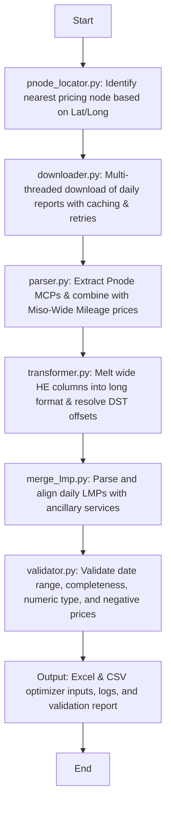

# MISO MCP/LMP Optimizer Dataset Compiler

A production-quality Python pipeline that automatically downloads, parses, matches, and compiles MISO (Midcontinent Independent System Operator) Ancillary Service Market Clearing Prices (MCP) and Locational Marginal Prices (LMP) into a single, clean, long-format hourly dataset ready for Battery Energy Storage System (BESS) revenue optimization models.

---

## Architecture Overview

The application is structured as a modular pipeline following object-oriented and data engineering best practices:



### Critical Design Features
1. **Ancillary Regulation Mileage Integration:**
   In MISO, individual pricing nodes (PNodes) do not clear separate mileage prices. `REGMILEAGEMCP` (mileage clearing price) is only cleared at the market-wide (`Miso-Wide` / `MISO Wide`) level. The parser automatically pulls the market-wide mileage price and merges it with the target PNode's capacity, spinning, and supplemental reserve prices.
2. **DST Timezone Alignments:**
   MISO publishes reports using Eastern Standard Time (EST) all year round, which has no DST transitions. BESS optimizers typically require local prevailing time (EPT). The transformer automatically shifts EST timestamps to Eastern Prevailing Time (`America/New_York`):
   - **Spring Forward (March):** Skips HE 3 (02:00 EDT), producing a 23-hour day.
   - **Fall Back (November):** Includes the duplicated local clock hour (01:00 EDT vs 01:00 EST), producing a 25-hour day distinguished by timezone offsets (e.g. `-04:00` vs `-05:00`).
3. **Multi-threaded Downloader & Cache:**
   Concurrent downloading downloads 365 days of data in under 5 minutes. If a file was previously downloaded, the downloader skips it. Failed downloads are retried with exponential backoff.

---

## Installation & Setup

1. **Clone or copy the project files** to your local workspace.
2. **Install dependencies** using pip:
   ```bash
   pip install -r requirements.txt
   ```
   *Note: On Windows, use `python -m pip install -r requirements.txt` if the `pip` global path is not configured.*

---

## Configuration

All pipeline parameters are managed in `config.py`.

### Location Setup
Configure how to select the target pricing node:
```python
# To search by coordinates:
USE_COORDINATES = True
LATITUDE = 39.534248
LONGITUDE = -87.976314

# To bypass coordinate search and use a specific node directly:
USE_COORDINATES = False
PNODE_NAME = "ALTW.AMESWIND"
```
The node coordinate database is stored in `data/miso_pnodes.csv`. It is automatically initialized with common nodes (including Ames Wind and Ameren Illinois nodes) on first run, and you can append rows to map your own project locations!

### Date Range Setup
Modify dates to download (e.g. one calendar year):
```python
START_DATE = "2025-01-01"
END_DATE = "2025-12-31"
```

### Optional Features
```python
DOWNLOAD_DAY_AHEAD = True  # Compiles Day-Ahead prices in addition to Real-Time
MERGE_LMP = True           # Downloads and merges Locational Marginal Prices
```

---

## Execution

To execute the pipeline, simply run the entry point script:

```bash
python main.py
```

During execution, the terminal will display downloading progress and pipeline milestones, while saving comprehensive execution logs to `logs/miso_pipeline.log`.

---

## Outputs

All output files are saved in the `output/` directory:

1. **`optimizer_input.xlsx`**: Excel workbook containing compiled, clean, long-format hourly prices. Features separate tabs for `Real-Time MCP` and `Day-Ahead MCP` (if enabled).
2. **`optimizer_input_rt.csv` / `optimizer_input_da.csv`**: Clean CSV versions formatted directly for database or BESS optimizer loading.
3. **`download_log.xlsx`**: Track of successes, file sizes, and attempts for each download date.
4. **`validation_report.xlsx`**: Detailed quality audit sheets mapping missing files, duplicate timestamps, missing values, invalid/negative prices, and DST adjustments.
